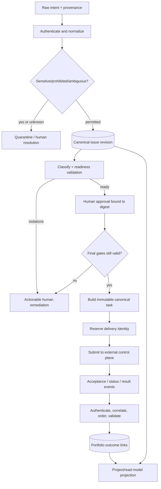
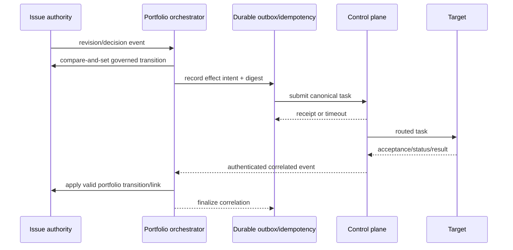

# Data Flow Design

## Data classes and authority

| Flow data | Source authority | Consumers | Required handling |
| --- | --- | --- | --- |
| Intent and revisions | Portfolio issue | governance, task builder, reporting | preserve provenance; classify/redact; revision checks |
| Approval evidence | Authorized human decision on issue | routing gate, audit | immutable actor/time/revision/digest; never inferred |
| Canonical task | Constructed portfolio command | control plane, target | versioned, authenticated, bounded, self-sufficient |
| Routing receipt/status | Control plane | reconciliation, portfolio view | correlate, authenticate, order, deduplicate |
| Execution evidence/result | Target through control plane | portfolio, reviewer, reporting | externally owned; validate and link, do not rewrite |
| Project fields | Derived from issue | humans/reports | publish freshness; detect drift; never authorize |

## Command and transformation flow

Normalization preserves the original input reference. Validation never silently supplies a
security- or authority-relevant default. Task construction includes only permissible, necessary
context and records omissions/redactions explicitly.

## Event flow

Duplicate events are no-ops only if identity and digest match. Stale events are retained for audit
but do not regress state. Divergent duplicates, impossible ordering, unknown identities and invalid
authentication are quarantined. A timeout after submission creates `handoff-uncertain`; only status
query/reconciliation establishes whether retry is safe.

## Control and projection flow

The issue revision controls all mutation. Policy/configuration snapshots control validation and are
recorded with decisions. Reconciliation control can retry transient effects with the same identity,
never minting a new authorization. Projection consumes issue/outcome facts asynchronously; user
edits to projected values are drift to repair or escalate, not commands to the domain.

## Inputs and outputs

Inputs: issue forms/edits, authenticated human governance commands, GitHub lifecycle events,
control-plane status/results, target disposition, configuration and reconciliation commands.
Outputs: authoritative issue transitions, canonical task submissions, audit facts, operational
telemetry, Project/read-model changes, reports, alerts and human action queues.

No cross-repository consumer may require undocumented access to internal persistence. Bulk exports
and reports apply authorization, redaction, pagination, freshness and retention policy.

