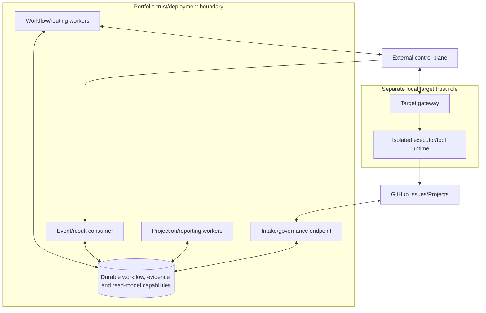

# Deployment Architecture

## Conceptual deployment

Boxes are logical deployment units, not required services, containers, products or cloud
resources. A small installation may co-locate units if permission separation and failure isolation
remain demonstrable. The local target role should not share portfolio credentials.

## Runtime units and scaling

Interfaces and query services are stateless where practical. Durable state captures workflow
intent, idempotency, correlation, audit and projection checkpoints without becoming canonical
portfolio authority. Workers scale horizontally across work-ID partitions; the same task/effect is
serialized. Project/report jobs batch and honor quotas. Executor capacity is target-owned and
isolated per attempt, with bounded CPU, memory, time, filesystem, network and tools.

## Availability and resilience

Deploy independent failure domains for authoritative portfolio transitions, external routing,
projection/reporting and target execution. Queue/durable checkpoint boundaries absorb transient
outages. Health includes dependency reachability, queue age, reconciliation backlog, config
validity and projection freshness. Project/report degradation cannot prevent safe issue operations;
identity/audit/contract failures block authority-changing actions.

Recovery must restore idempotency, audit, workflow correlations and read-model checkpoints without
replaying unsafe effects. Backups, RPO/RTO, regions, support hours and disaster recovery topology
are not specified until owners approve requirements; semiannual recovery evidence is expected by
the requirements baseline.

## Independent delivery

Portfolio, control plane and targets release independently through compatible contract overlap.
Deployment uses staged activation, migration validation, feature disable/rollback and configuration
version pinning. No rollout may silently change approval semantics, task digest rules or lifecycle
mapping. Environments isolate credentials/data; nonproduction must not route production tasks.

## Conceptual operational ownership

Repository maintainers own portfolio unit deployability and local-target behavior; organization
owners own the control plane; target owners own executor deployment. Concrete infrastructure,
orchestrator, regions, persistence technology and network layout are intentionally unspecified.

