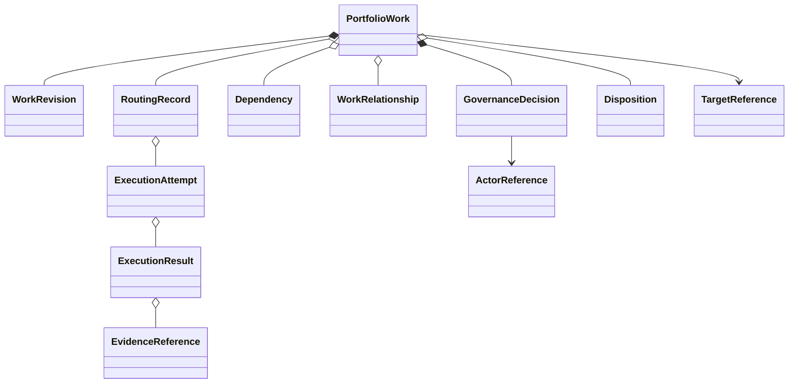

# Domain Model

## Ubiquitous language

| Term | Meaning |
| --- | --- |
| Portfolio Work | Governed record connecting a need to lifecycle, authority and outcome. |
| Executable Task | Bounded, target-specific Portfolio Work eligible for one authorization. |
| Canonical Task | Immutable self-sufficient handoff constructed from an approved revision. |
| Approval | Attributable human authorization bound to material-field digest and revision. |
| Projection | Non-authoritative representation of issue-owned state. |
| Execution Result | Externally owned, authenticated evidence correlated to a task attempt. |
| Disposition | Human target/portfolio decision about an execution outcome. |

## Aggregate model

### Portfolio Work aggregate

The aggregate root owns identity, work type, intent, rationale, bounded requirements, target,
executor intent, classification, priority, risk, dependencies, hierarchy, revision, lifecycle,
approval decisions, routing correlations, result links and final portfolio disposition. It enforces
transitions and prevents stale or conflicting effects.

### Entities

* **WorkRevision:** immutable snapshot/digest, actor, provenance, timestamp, materiality.
* **GovernanceDecision:** priority/approval/revocation decision, actor authority evidence, reason,
  decision time and bound revision.
* **RoutingRecord:** stable delivery identity, contract version, digest, status and reconciliation.
* **ExecutionAttempt:** target-owned attempt identity and ordered status, represented locally.
* **ExecutionResult:** validated outcome, safe diagnostics, evidence and draft reference.
* **Disposition:** human review outcome (accepted, changes requested, rejected, superseded, or other
  governed vocabulary) with rationale and actor.

### Value objects

Work ID, issue reference, revision, semantic digest, actor reference, provenance, work type,
priority, risk, sensitivity decision, target reference, executor reference, contract version,
dependency reference/state, acceptance criterion, evidence reference, correlation ID, delivery ID,
timestamp and violation are immutable and validated by construction.

## Relationships and ownership

A strategic objective can contain outcomes, capabilities and executable leaves. Every executable
leaf has at most one target; cross-target outcomes require separately approved children. Parent
links provide rationale, never inherited approval. Dependencies are typed and have explicit
known/open/closed/unknown status; open blockers, self-links and cycles prevent readiness. Project
items and optional mirrors reference but do not belong to the aggregate.

## Lifecycle and invariants

1. One GitHub issue is authoritative for an executable task.
2. Creation, editing, priority and Project movement never constitute approval.
3. Approval is human, attributable, current, revocable and bound to material content.
4. Any material change invalidates approval before routing; reopening requires fresh evaluation.
5. One authorization has one target and one logical active execution/publication outcome.
6. A stable identity cannot be reused with a different semantic digest.
7. Routing requires complete context, resolved blockers, permitted sensitivity, registered target
   and executor, compatible contract and current approval.
8. Results cannot change intent or retroactively authorize work; they are applied only after
   authentication, correlation, schema and ordering validation.
9. Automated publication is draft-only and is not delivery completion.
10. Closure preserves history; reopen/supersession links rather than erases prior decisions.
11. Unknown or contradictory safety/authority facts lead to a blocked/quarantined state.

## Conceptual consistency

The issue is the business source of truth. Durable workflow/idempotency records are operational
facts and audit support, not competing work records. Execution evidence remains owned by its
producer; this domain retains an authenticated reference and validated summary. No database schema
or serialization format is prescribed by this model.

