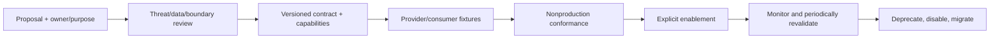

# Extension Architecture

## Extension philosophy

Extensions add capabilities behind owned ports without changing core authority: Issues remain
canonical, approval is explicit/current/human, one authorization has one target, the control plane
routes, targets own execution, and automated publication remains draft-only. Extension discovery
cannot itself grant permission.

## Extension points

| Point | Extension contract | Conformance obligations |
| --- | --- | --- |
| Intake channel/parser | Produce normalized intent and provenance | deterministic parsing, untrusted-input/sensitivity handling, no approval |
| Taxonomy/policy package | Versioned values, mappings and rule decisions | owner approval, migration, historical reproducibility |
| Contract codec/version | Translate canonical semantic model | schema/semantic compatibility, fixtures, no field loss |
| Target adapter/registration | Declare capability and address organization route | owner, auth, policy, retry/concurrency/evidence/SLO and disable plan |
| Executor | Act inside target-owned bounded runtime | allowlisted effects, model/tool evaluation, evidence, draft-only publish-once |
| Project/read-model adapter | Map declared authority and freshness | no Project approval, drift/conflict tests, rate limiting |
| Reporting/export sink | Consume authorized read facts | access control, definitions, redaction, retention, accessibility |
| Evidence/telemetry adapter | Preserve or export safe operational facts | integrity, access, redaction, correlation and failure semantics |
| Optional reference provider | Resolve consulting or other approved context | stable version/provenance, licensing, withdrawal and confidentiality |

## Onboarding lifecycle

Conformance tests cover authentication, valid and invalid versions, permission denial, sensitive
input, size limits, replay/digest conflict, concurrency, timeout ambiguity, evidence accuracy,
redaction and rollback. Target/executor extensions remain disabled until all safety-critical
unknowns are resolved by their owners.

## Customization boundaries

Targets may tighten policy, validation, tools, evidence and capacity; they cannot weaken shared
requirements. Portfolio installations may add taxonomy/reporting dimensions through governed
versions; they cannot make priority or Project placement authorization. Optional Slugger mirroring
is a projection extension with a distinct contract. Consulting methods remain external referenced
content, not copied implementation or implicit execution instructions.

## Future capabilities

Additional planning channels, portfolio analytics, secure reference resolution, executor classes,
targets and evidence stores are possible if requirements and contracts authorize them. Autonomous
approval, automatic merge/deploy, direct undocumented target dispatch and shared mutable state are
not extension points; they require vision/requirements change and a superseding ADR.

## AI-agent friendliness

Publish machine-readable schemas, semantic examples, invariant checklists, stable error codes,
capability manifests and deterministic contract fixtures. Every generated change must cite task
identity/revision, respect repository-local instructions, report checks actually run, preserve
uncertainty, and yield reviewable evidence. A model/tool/version change triggers evaluation rather
than inheriting trust from a prior executor.

