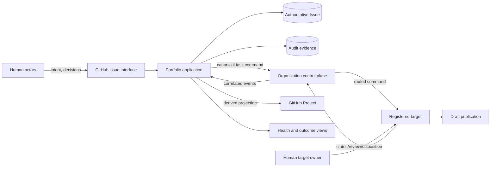
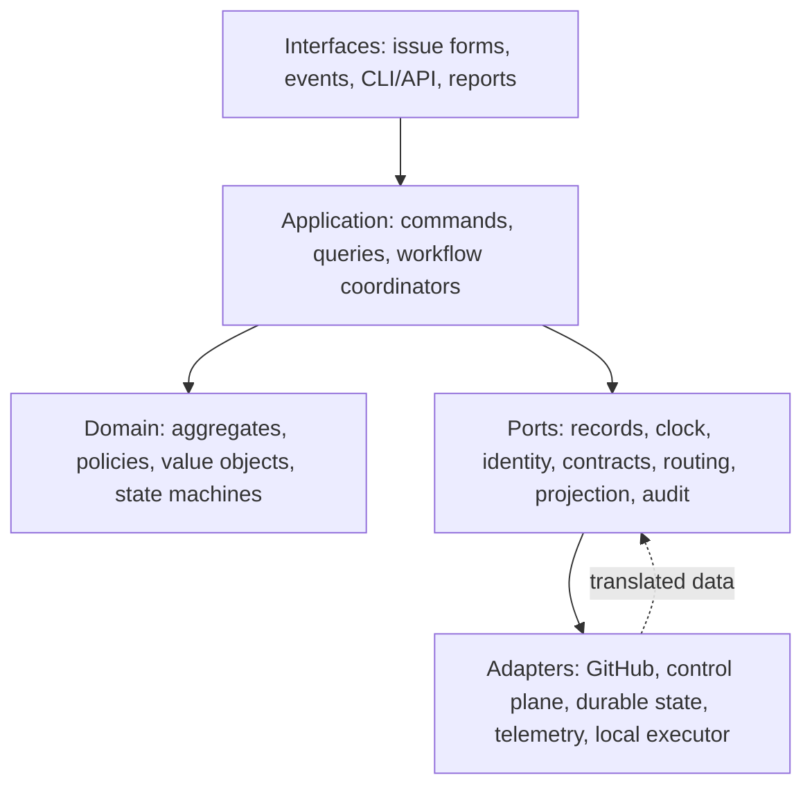
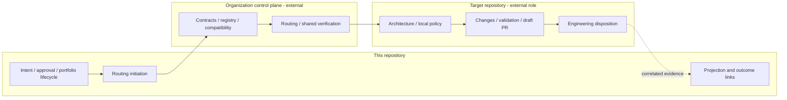

# High-Level Design

## Context and decomposition

The portfolio application is a logical system, not a prescribed process topology. It comprises the
following subsystems:

| Subsystem | Owns | Must not own |
| --- | --- | --- |
| Experience | Structured intake, explanations, accessible views | Business authorization rules |
| Domain & Governance | Invariants, lifecycle, readiness, approvals | GitHub/API mechanics |
| Orchestration | Use-case order, units of work, effect coordination | External router behavior |
| Integration | GitHub and control-plane adapters | Domain decisions |
| Projection & Insight | Projects, dashboards, drift and metrics | Canonical authority |
| Evidence & Operations | Audit, telemetry, reconciliation queues | Secrets or unredacted task bodies in logs |
| Local Target Gateway | `portfolio-tasks` target policy/execution boundary | Other targets or portfolio approval |

## Architectural layers

Dependencies point inward. Domain types never import adapter types. Interfaces authenticate and
parse; application services orchestrate; domain services decide; adapters perform effects.

## Primary information flow

1. Intake records raw provenance and normalized structured intent in an issue at a known revision.
2. Classification and governance evaluate completeness, sensitivity, hierarchy, dependencies, and
   target/executor eligibility without granting approval.
3. An authorized human approves a digest of material fields at that revision.
4. The task builder creates an immutable, versioned, self-contained command.
5. The routing initiator reserves the stable delivery identity, rechecks authority, and submits to
   the external control plane.
6. Acceptance, status, result, and disposition arrive as authenticated, ordered, correlated facts.
7. The portfolio applies valid facts, exposes conflicts for reconciliation, and updates derivative
   views. Human review remains external to automated completion.

## Ownership boundaries

The same GitHub repository may host both portfolio and local target adapters, but the roles require
different authority checks and should be independently deployable and permissioned.

## External dependencies

GitHub supplies issue, identity, history, Project and event capabilities. The organization control
plane supplies schemas, registration, routing, compatibility and results. Target repositories
supply local execution and evidence. Slugger mirroring and consulting references are optional and
disabled until their owners validate contracts. See `IntegrationArchitecture.md` for certainty.

## Consistency and scaling

Canonical issue transitions require optimistic revision checks. Cross-boundary consistency is a
saga: reserve intent, submit, record receipt, consume events, reconcile ambiguity. Work is
serialized per canonical task/delivery identity while unrelated tasks scale horizontally.
Projections are eventually consistent and must publish freshness and drift. Backpressure is
preferable to bypassing validation or dropping evidence.

