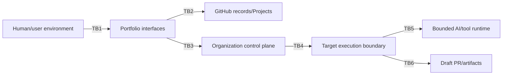

# Security Architecture

## Security objectives and trust boundaries

Protect human authority, task/result integrity, confidential context, credentials and audit
evidence while treating issue content, external events and AI output as untrusted.

At each boundary authenticate the producer, authorize the operation, validate version/schema and
semantic authority, constrain data/effects, correlate identity and write redacted evidence.

## Authentication and authorization concepts

Human identity must be attributable through a validated organization identity source; service
identity must be workload-specific and non-human. Authorization is deny-by-default, operation and
repository scoped, and evaluated at use time. Roles for author, prioritizer, approver, revoker,
reconciler, target owner, reviewer and administrator remain distinct even when one person holds
several. Bot activity cannot satisfy human approval. Separation of duties is policy-configurable
and unresolved risk classes fail closed.

Approval evidence contains actor, authority basis, time, revision/digest, decision and reason.
Targets repeat shared and local authorization checks. Revocation/material edits prevent new
initiation; cancellation of an already accepted attempt depends on a validated external contract.

## Confidentiality, integrity and secrets

Classify data before persistence or handoff; send only necessary permitted content. Prohibited,
secret-bearing or uncertain content is quarantined/redacted and never copied to Projects, logs,
prompts or artifacts. Encryption in transit and at rest is required at every supported boundary,
subject to platform validation. Integrity requires authenticated envelopes, semantic digests,
revision checks and tamper-evident evidence where supported.

Credentials live in an approved secret manager/platform secret facility, never issues,
configuration, payloads, logs or generated patches. Use short-lived credentials where possible,
scope by repository/operation/environment, rotate and revoke, prevent fork/untrusted-context
exposure, and audit use. Portfolio, projection, router consumer and local target identities should
be distinct.

## Threat considerations

| Threat | Controls |
| --- | --- |
| Forged/stale approval or confused deputy | human attribution, role checks, digest/revision binding, target revalidation |
| Prompt/instruction injection in issue or result | data/instruction separation, allowlisted tools/effects, sandbox, output validation |
| Replay/duplicate PR | delivery/event IDs, payload digest, durable idempotency and publish-once guard |
| Tampered/out-of-order result | producer authentication, integrity, correlation and state ordering |
| Secret/data exfiltration | classification, minimization, egress/tool controls, redaction and artifact scanning |
| Dependency/supply-chain compromise | pinned/verified automation, least privilege, target validation and provenance |
| Project/mirror used as authority | one-way authority mapping and independent routing gates |
| Denial of service/quota exhaustion | size/rate limits, backpressure, circuit breakers, bounded queues |
| Audit deletion/repudiation | append-only semantics, restricted access, retention/legal-hold validation |

## Audit and assurance

Audit intake provenance, revision/materiality, readiness, authorization, configuration, routing,
replay/conflict, external event, reconciliation, projection drift, target evidence and human
disposition. Security logs exclude raw sensitive bodies and secrets. Access to audit/export is
authorized and itself audited. Threat modeling, credential rotation tests, adversarial prompt tests,
contract fuzzing and incident exercises are release evidence.

## Unresolved policy

Data classes, privacy/client/regulatory obligations, approver registry, separation of duties,
retention/deletion/legal hold, incident response, authentication protocol and platform audit
capability require owner approval. Affected automation remains disabled rather than assuming them.

