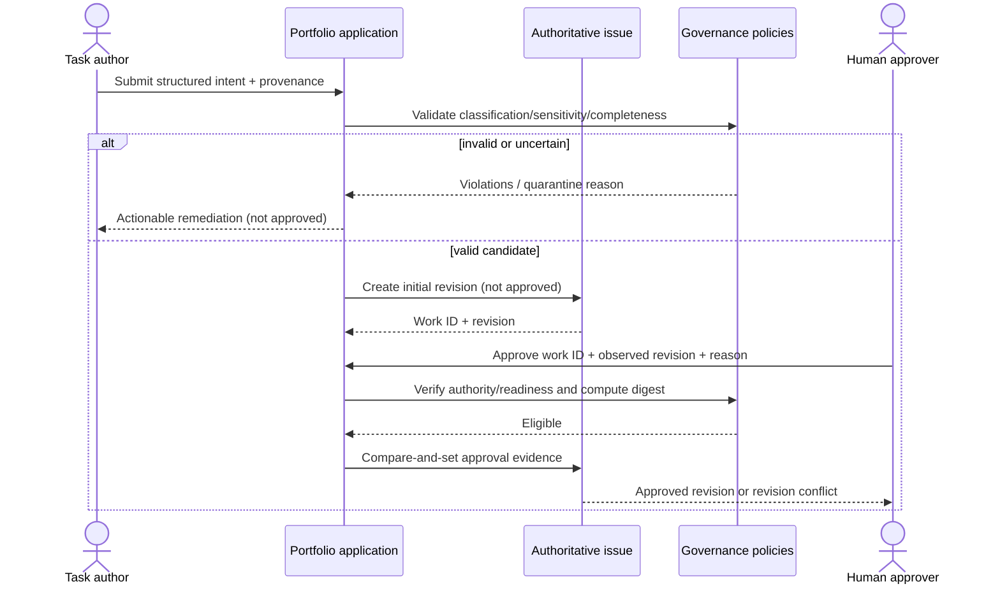
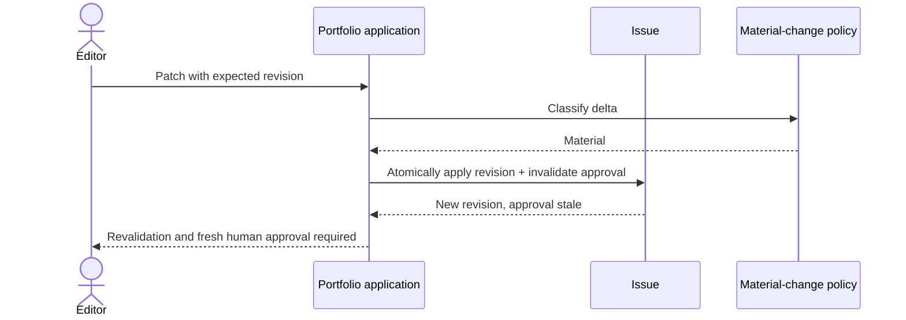
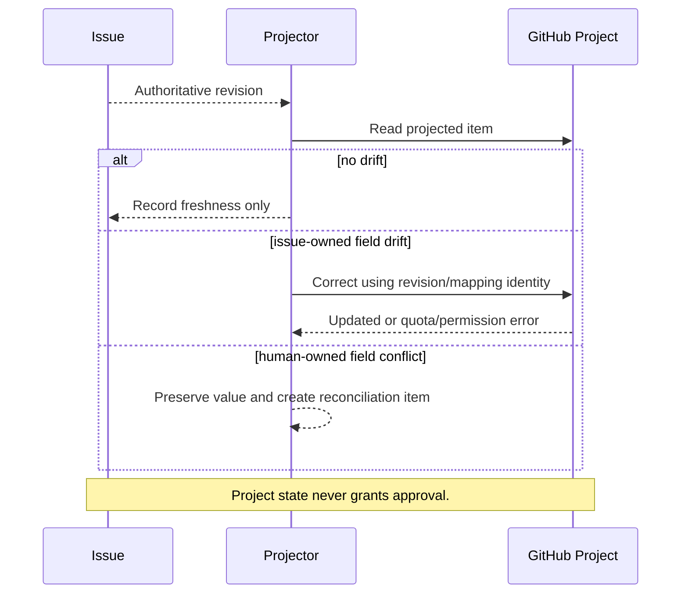

# Sequence Diagrams

## Intake, remediation and approval



## Material edit after approval (alternate flow)



## Successful routing and outcome

```mermaid
sequenceDiagram
  actor H as Authorized human
  participant P as Portfolio
  participant D as Idempotency/evidence
  participant C as Control plane
  participant T as Target
  actor R as Target reviewer
  H->>P: Initiate approved task
  P->>P: Recheck revision, approval, dependency, sensitivity, compatibility
  P->>D: Reserve delivery ID + semantic digest
  P->>C: Canonical task
  C-->>P: Authenticated accepted receipt
  C->>T: Routed target task
  T->>T: Shared + target-local validation
  T-->>C: accepted / executing
  T-->>C: terminal result + evidence + draft reference
  C-->>P: Correlated ordered events
  P->>D: Deduplicate and preserve audit
  P->>P: Link result; await human disposition
  R->>T: Review / merge or reject decision
  T-->>C: Disposition (when contracted)
  C-->>P: Disposition evidence
```

## Timeout, replay and reconciliation failure flow

```mermaid
sequenceDiagram
  participant P as Portfolio
  participant D as Idempotency record
  participant C as Control plane
  P->>D: Reserve delivery-7 + digest-A
  P->>C: Submit delivery-7
  C--xP: Timeout after possible acceptance
  P->>D: Mark handoff-uncertain
  P->>C: Query delivery-7
  alt found
    C-->>P: Authenticated accepted/status
    P->>D: Finalize without resubmission
  else contract proves never accepted and retry safe
    C-->>P: Not found + retry-safe
    P->>C: Retry same delivery-7 + digest-A
  else no conclusive evidence
    C-->>P: Unknown/Unavailable
    P->>D: Keep blocked; alert human reconciliation owner
  end
  Note over P,C: A replay with digest-B is a conflict, never an update.
```

## Invalid or out-of-order result

```mermaid
sequenceDiagram
  participant C as External producer
  participant P as Result ingestor
  participant Q as Quarantine
  participant I as Issue
  C->>P: Result event
  P->>P: Authenticate, validate schema/version/correlation/order
  alt exact duplicate
    P-->>C: Acknowledge duplicate/no-op
  else stale but valid
    P->>Q: Retain audit; no state regression
  else forged, divergent, unknown or impossible
    P->>Q: Quarantine + alert
    P-->>C: Rejected/conflict
  else valid
    P->>I: Apply compared transition/result link
  end
```

## Project drift



