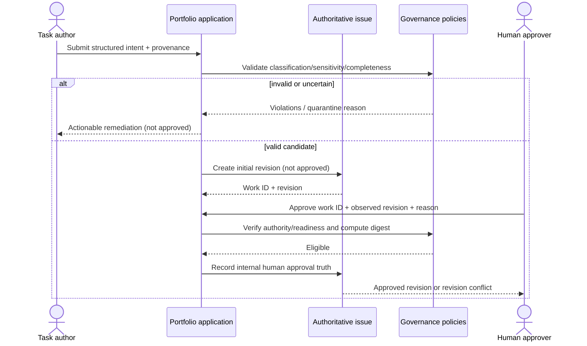
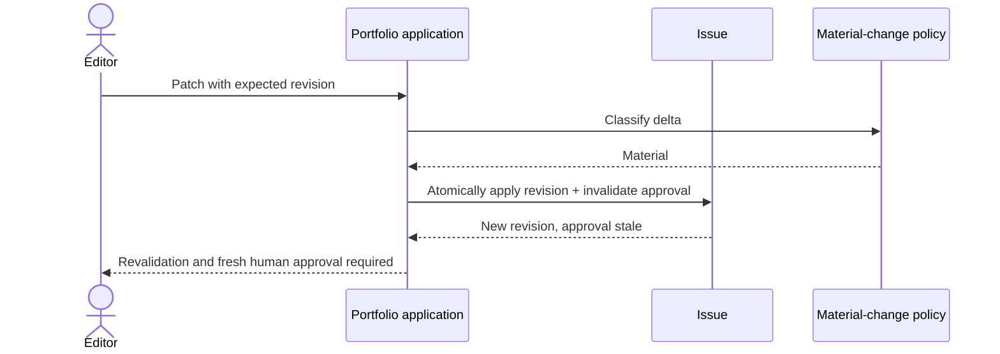
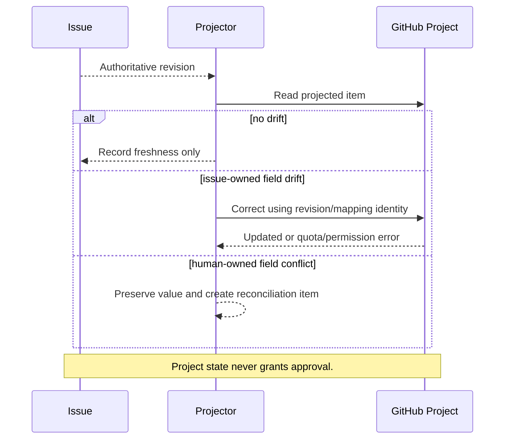
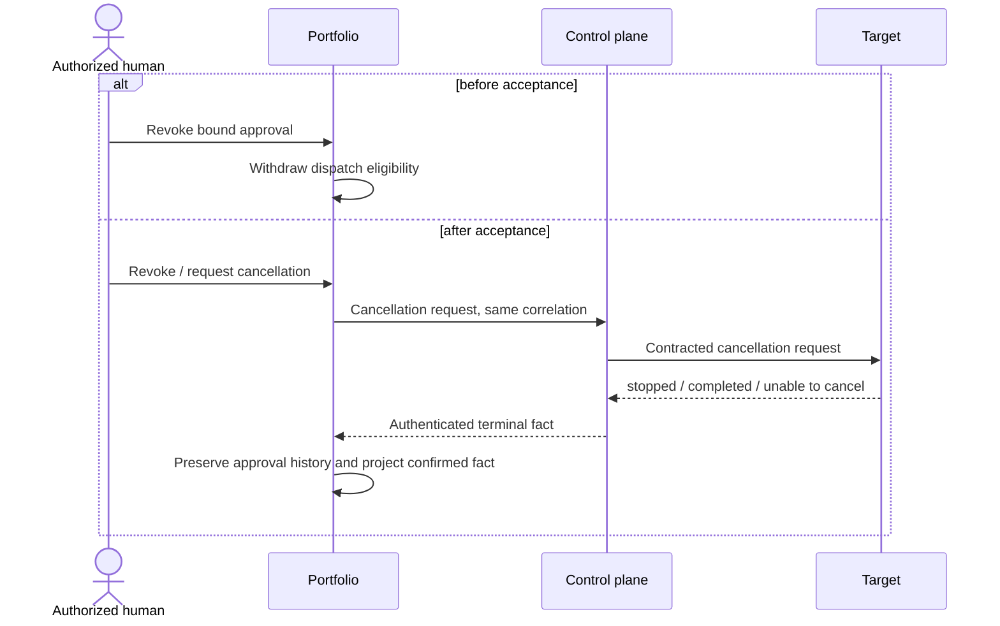

# Sequence Diagrams

## Intake, remediation and approval



## Material edit after approval (alternate flow)



## Successful routing and outcome

```mermaid
sequenceDiagram
  actor H as Authorized human
  participant P as Portfolio
  participant D as Idempotency/evidence
  participant C as Router / control plane
  participant T as Target
  participant V as Organization result receiver
  actor R as Target reviewer
  H->>P: Initiate approved task
  P->>P: Recheck revision, approval, dependency, sensitivity, compatibility
  P->>D: Reserve delivery ID + semantic digest
  P->>C: Canonical task
  C-->>P: Authenticated accepted receipt
  C->>T: Routed target task
  T->>T: Validate canonical v2 input + target-local policy
  T->>T: Create or reuse one owned draft PR
  T->>V: Canonical execution-result/v2 + source_issue
  V->>V: Authenticate; validate schema, source, and identity
  V-->>T: Transport accepted or fail closed
  T->>P: Invoke portfolio result ingestion with receiver-validated result
  P-->>T: Projection accepted, duplicate, or quarantined
  P->>D: Deduplicate and preserve audit
  P->>P: Consume result; show correlation + draft on source issue
  Note over C,V: The router does not receive or project the canonical result.
  Note over P,T: Labels are projections, never cross-boundary authority.
  R->>T: Review / merge or reject decision
  Note over R,P: Post-MVP disposition transport is not implied by this sequence.
```

The receiver acknowledgement and validated outputs return to its direct caller, the target; the
receiver does not call the portfolio. Portfolio completion therefore requires a separate,
authenticated target-to-portfolio result-ingestion invocation carrying the receiver-validated
canonical result. That invocation projects `execution_status` separately from router admission,
target acceptance, and result transport. The target-to-portfolio invocation is still a planned
integration boundary, and the currently frozen receiver fails closed, so the successful result
steps above are not a claim of live cross-repository conformance.

## Target publication create race

```mermaid
sequenceDiagram
  participant T as Target adapter
  participant G as GitHub
  participant Q as Ownership query
  T->>Q: Query branch and PRs in all states by delivery_id + ai-sdlc-delivery-id
  Q-->>T: No owned publication
  T->>G: Create deterministic branch / draft PR
  G--xT: Already exists, conflict, or ambiguous response
  T->>Q: Requery branch and PRs in all states by ownership identity
  alt exactly one owned open draft PR
    Q-->>T: Unique managed publication
    T->>T: Reuse; do not create a second PR
  else any owned closed or merged PR
    Q-->>T: Historical managed publication
    T->>T: Fail closed for manual intervention; do not recreate
  else no conclusive owned publication
    Q-->>T: Not found / uncertain
    T->>T: Stop and reconcile; do not blindly retry creation
  else multiple or conflicting owners
    Q-->>T: Ambiguous ownership
    T->>T: Quarantine; no overwrite, close, or publication
  end
```

A create conflict or ambiguous create response is not terminal evidence by itself. The adapter
MUST requery using the deterministic `delivery_id` branch identity and `ai-sdlc-delivery-id`
ownership marker across all pull-request states. Only one uniquely owned open draft PR may be
reused. Any matching closed or merged PR fails closed even if its branch was deleted; absence or
ambiguity also fails closed without another visible effect.

## Timeout, replay and reconciliation failure flow

```mermaid
sequenceDiagram
  participant P as Portfolio
  participant D as Idempotency record
  participant C as Control plane
  P->>D: Reserve delivery-7 + digest-A
  P->>C: Submit delivery-7
  C--xP: Timeout after possible acceptance
  P->>D: Mark handoff-uncertain
  P->>C: Query delivery-7
  alt found
    C-->>P: Authenticated accepted/status
    P->>D: Finalize without resubmission
  else contract proves never accepted and retry safe
    C-->>P: Not found + retry-safe
    P->>C: Retry same delivery-7 + digest-A
  else no conclusive evidence
    C-->>P: Unknown/Unavailable
    P->>D: Keep blocked; alert human reconciliation owner
  end
  Note over P,C: A replay with digest-B is a conflict, never an update.
```

## Invalid or out-of-order result

```mermaid
sequenceDiagram
  participant C as External producer
  participant P as Result ingestor
  participant Q as Quarantine
  participant I as Issue
  C->>P: Result event
  P->>P: Authenticate, validate schema/version/correlation/order
  alt exact duplicate
    P-->>C: Acknowledge duplicate/no-op
  else stale but valid
    P->>Q: Retain audit; no state regression
  else forged, divergent, unknown or impossible
    P->>Q: Quarantine + alert
    P-->>C: Rejected/conflict
  else valid
    P->>I: Apply compared transition/result link
  end
```

## Project drift




## Revocation around dispatch


