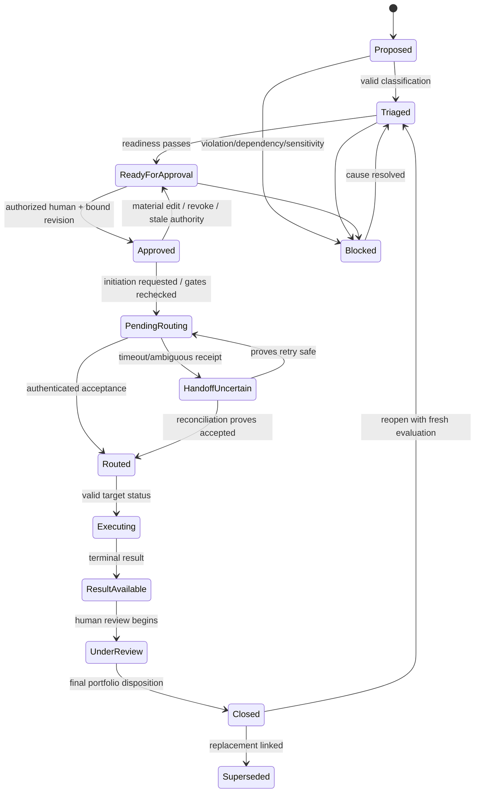
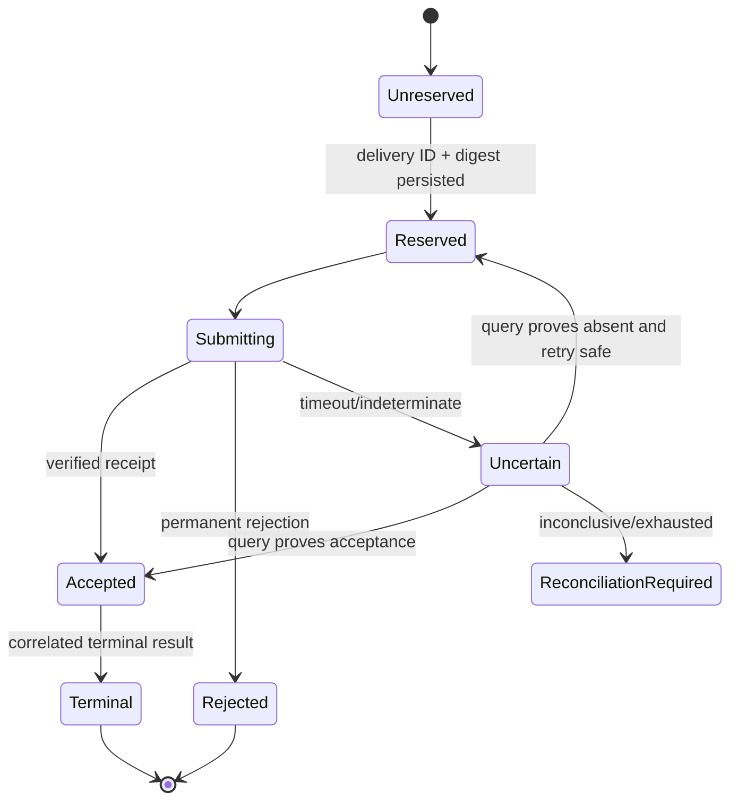

# State Models

## Portfolio lifecycle

These are semantic states; UI labels may differ only via an explicit versioned mapping. `Blocked`
requires a cause and next owner. `Closed` does not imply merged or deployed. Cancellation semantics
beyond pre-route revocation are an unresolved governance/contract question and must fail closed.

## Approval state

| State | Entry | Exit / rule |
| --- | --- | --- |
| Not requested | intake or changed work | readiness allows request |
| Eligible | all gates except human decision pass | approve, new violation, or material edit |
| Approved-current | authorized human decision matches revision/digest | revoke, expire if policy defines, material edit, authority invalidation |
| Revoked | attributable human revocation | new readiness evaluation and new approval |
| Stale | material content/authority/policy change invalidates binding | never auto-restored; fresh approval required |
| Denied | human denial with reason | governed amendment/reconsideration |

## Routing delivery state

Same ID/same digest replay returns recorded state. Same ID/different digest transitions to conflict
quarantine, not any normal state.

## Target attempt state

Valid semantic progression is `received → validating → accepted/queued → executing →
blocked-or-terminal`. Validation may yield rejected. Terminal outcomes include succeeded, failed,
cancelled only if externally contracted, and no-change where policy supports it. A draft reference
is evidence, not a state equivalent to accepted/merged/delivered. Status must never regress; late
events are audited without changing state.

## Projection state

`unknown → current → stale/drifted → reconciling → current`, with `conflict` or `unavailable`
requiring operator attention. Projection state is independent of portfolio approval/routing.

## Entry/exit discipline

Every transition records prior/new state, work revision, actor/service identity, cause, policy and
contract version, correlation, timestamp and evidence reference. Exit effects are idempotent.
Impossible transitions are rejected/quarantined and observable rather than coerced.

