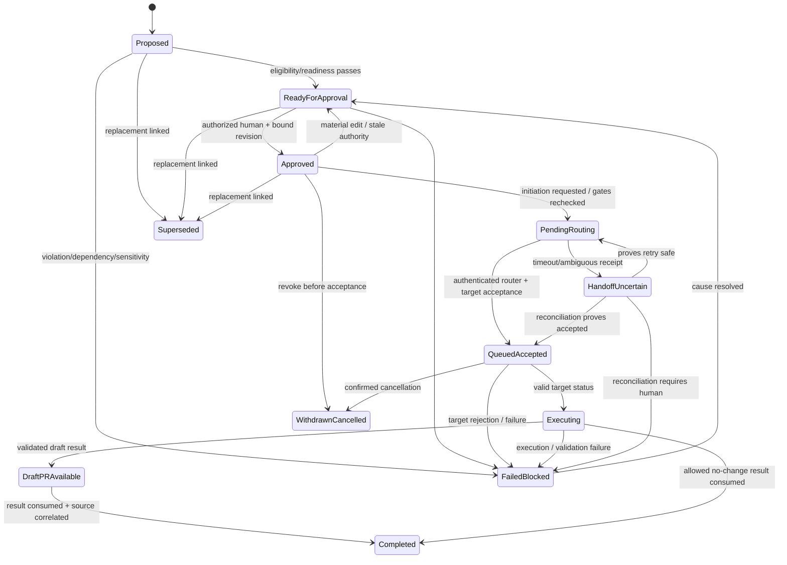
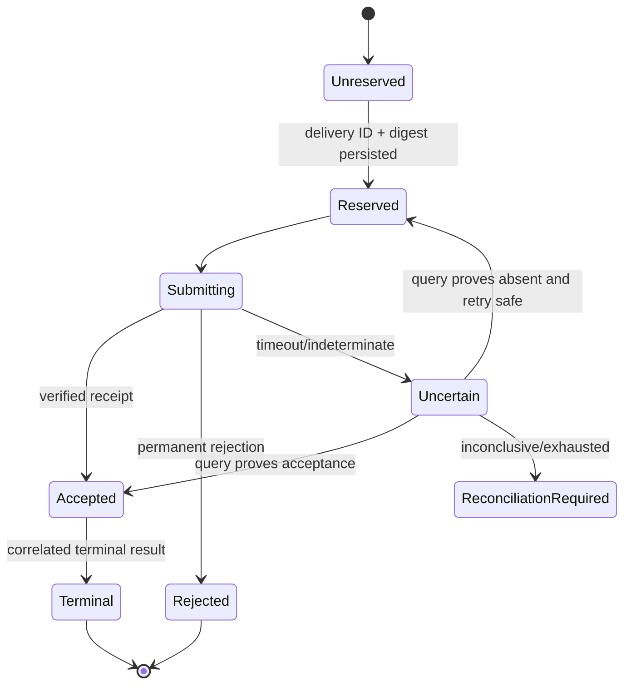

# State Models

## Portfolio lifecycle

These are semantic states; UI labels may differ only via an explicit versioned mapping. Labels are
not authority. `Failed / blocked` requires a cause, correlation, next owner, and recovery action.
`Completed` means the portfolio consumed a validated terminal result and displayed its correlation;
it does not imply merged, released, or deployed. Post-acceptance revocation is a cancellation
request and cannot transition to cancelled until the externally owned contract confirms it.

## Approval state

| State | Entry | Exit / rule |
| --- | --- | --- |
| Not requested | intake or changed work | readiness allows request |
| Eligible | all gates except human decision pass | approve, new violation, or material edit |
| Approved-current | immutable authorized-human evidence matches revision/digest, target, executor, and policy | revoke, expire if policy defines, material edit, authority invalidation; label changes alone have no effect |
| Revoked | attributable human revocation | new readiness evaluation and new approval |
| Stale | material content/authority/policy change invalidates binding | never auto-restored; fresh approval required |
| Denied | human denial with reason | governed amendment/reconsideration |

## Routing delivery state

Same ID/same digest replay returns recorded state. Same ID/different digest transitions to conflict
quarantine, not any normal state.

## Target attempt state

Valid semantic progression is `received → validating → accepted/queued → executing → draft PR
available or failed/blocked/cancelled/allowed no-change`. Validation may yield rejected. A draft
reference is evidence, not merged or delivered. The portfolio reaches `Completed` only after it
consumes the authenticated compatible terminal result and exposes correlation on the source issue.
Status never regresses; exact duplicate results are no-ops, divergent duplicates are quarantined,
and late events are audited without changing state.

## Projection state

`unknown → current → stale/drifted → reconciling → current`, with `conflict` or `unavailable`
requiring operator attention. Projection state is independent of portfolio approval/routing.

## Entry/exit discipline

Every transition records prior/new state, work revision, actor/service identity, cause, policy and
contract version, correlation, timestamp and evidence reference. Exit effects are idempotent.
Impossible transitions are rejected/quarantined and observable rather than coerced.
