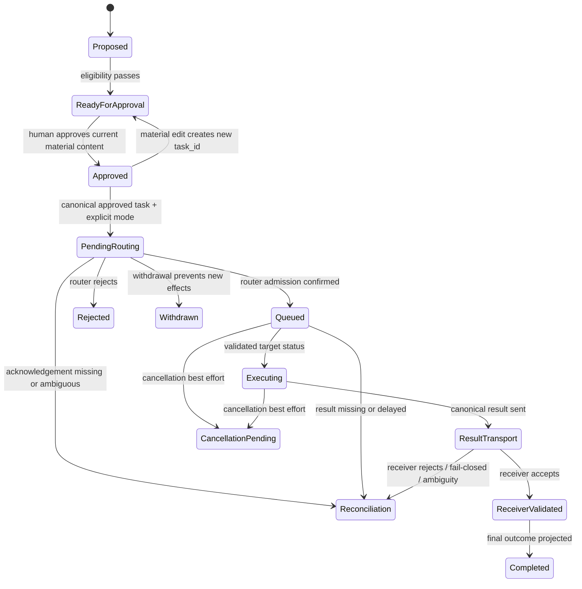

# State Models

## Portfolio lifecycle

`Approved` is the only router-admissible canonical task status. `Queued` is created only after
router admission and is never fresh authorization. Router admission, delivery acceptance, target
execution, result transport, receiver validation, and final outcome are distinct facts. A transport
acknowledgement is not execution success. `Completed` means a receiver-validated canonical result
has been projected; it does not mean merged, released, deployed, or production-ready.

## Approval and task identity

| State | Entry | Exit / rule |
| --- | --- | --- |
| Not approved | intake, rejection, withdrawal, or changed work | current material content receives human approval |
| Approved current task | human approves current material content and its exactly-one-target selection | dispatch, withdrawal, or material edit |
| Superseded identity | any material edit after approval | create a new `task_id`; rerun readiness and obtain new approval |

Rich approval provenance may be retained in repository-internal audit records. Approval ID,
revision digest, approver, approval timestamp, revocation record, and freshness metadata are not
transported as undeclared fields in the closed v2 schemas.

## Delivery and result identity

`delivery_id` is the idempotency key. At-least-once retries for the same logical delivery preserve
it and cause idempotent visible effects. `correlation_id` is the end-to-end observability identity.
An identical duplicate result is a no-op; a conflicting duplicate is quarantined. Missing, delayed,
rejected, or ambiguous results enter reconciliation rather than blind redispatch.

## Withdrawal and cancellation

Withdrawal while the source still controls execution prevents new side effects. After execution
begins, cancellation is best effort and state remains honest about effects already started. A
cancel request never rewrites prior authorization or implies that execution stopped.

## Projection discipline

Each source projection records the identities and evidence listed in the next-MVP baseline and
never advances beyond the last validated fact. Impossible or out-of-order transitions are rejected
or quarantined and made observable rather than coerced.
